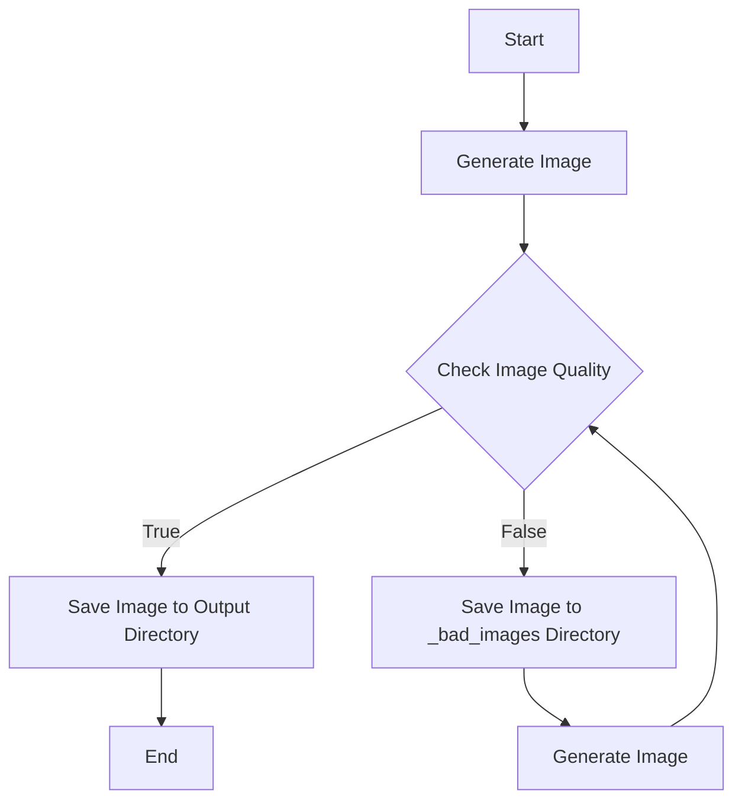

# Azure Dalle3 Image Generation and Quality Check using GPT-4o

This project uses OpenAI's Azure API to generate images with Dalle3 and employs GPT mode as an image checker to review the generated images. This is necessary because Dalle3 often does not follow instructions correctly. Below is a step-by-step guide on how to run this code.

## Environment Setup

1. **Clone the project**:
   ```bash
   git clone <your-repo-url>
   cd <your-repo-directory>
   ```

2. **Create a virtual environment**:
   ```bash
   python3 -m venv venv
   source venv/bin/activate  # Linux/MacOS
   # .\venv\Scripts\activate  # Windows
   ```

3. **Install dependencies**:
   ```bash
   pip install -r requirements.txt
   ```

4. **Set environment variables**:
   - Create a `.env` file and add the following content:
     ```
     AZURE_OPENAI_API_VERSION=<your-api-version>
     AZURE_OPENAI_API_ENDPOINT=<your-api-endpoint>
     AZURE_OPENAI_API_KEY=<your-api-key>
     GPT_4O_API_URL=<your-gpt-4o-api-url>
     OUTPUT_DIRECTORY=<your-output-directory>
     ```

## Run the Code

1. **Execute the main script**:
   ```bash
   python image_generation.py
   ```

2. **Check the output**:
   - The generated images will be saved in the specified output directory.
   - If the images do not meet the standards, they will be saved in the `_bad_images` subdirectory.

## Code Logic Diagram



## Notes

- Ensure all environment variables are set correctly.
- Ensure a stable network connection to access the Azure OpenAI API.
