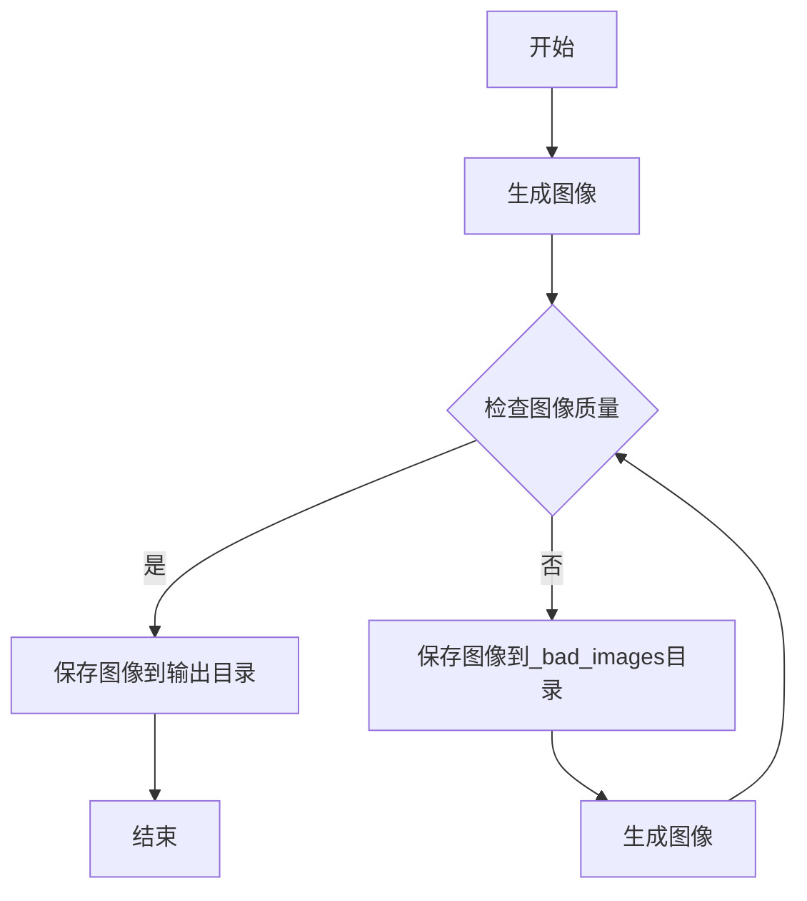

# 图像生成与质量检查

本项目使用 OpenAI 的 Azure API 通过 Dalle3 生成图像，并使用 GPT 模式作为图像检查器来审核生成的图像。因为 Dalle3 通常有一定的概率不能正确遵循指令。以下是如何运行此代码的步骤指南。

## 环境准备

1. **克隆项目**：
   ```bash
   git clone <your-repo-url>
   cd <your-repo-directory>
   ```

2. **创建虚拟环境**：
   ```bash
   python3 -m venv venv
   source venv/bin/activate  # Linux/MacOS
   # .\venv\Scripts\activate  # Windows
   ```

3. **安装依赖**：
   ```bash
   pip install -r requirements.txt
   ```

4. **设置环境变量**：
   - 创建一个 `.env` 文件，并添加以下内容：
     ```
     AZURE_OPENAI_API_VERSION=<your-api-version>
     AZURE_OPENAI_API_ENDPOINT=<your-api-endpoint>
     AZURE_OPENAI_API_KEY=<your-api-key>
     GPT_4O_API_URL=<your-gpt-4o-api-url>
     OUTPUT_DIRECTORY=<your-output-directory>
     ```

## 运行代码

1. **执行主脚本**：
   ```bash
   python image_generation.py
   ```

2. **查看输出**：
   - 生成的图像将保存在指定的输出目录中。
   - 如果图像不符合标准，它将被保存到 `_bad_images` 子目录中。

## 代码逻辑图



## 注意事项

- 确保所有环境变量都已正确设置。
- 确保网络连接正常，以便访问 Azure OpenAI API。
